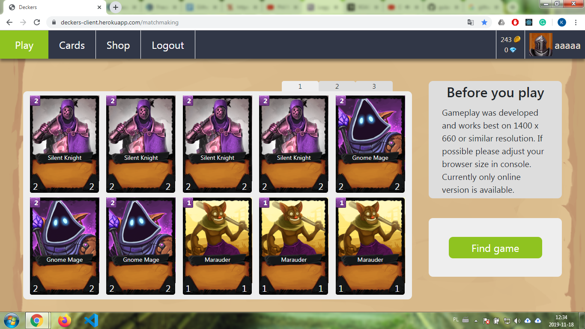
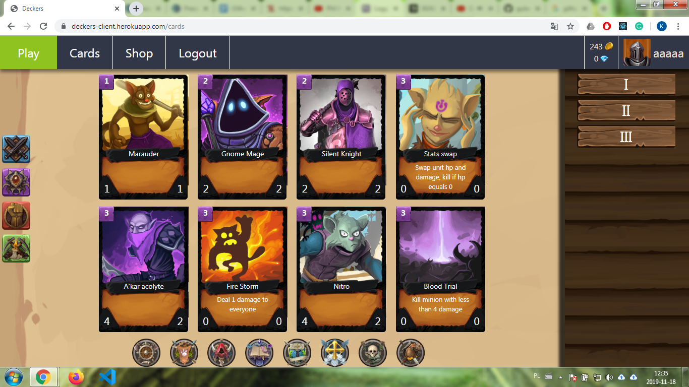
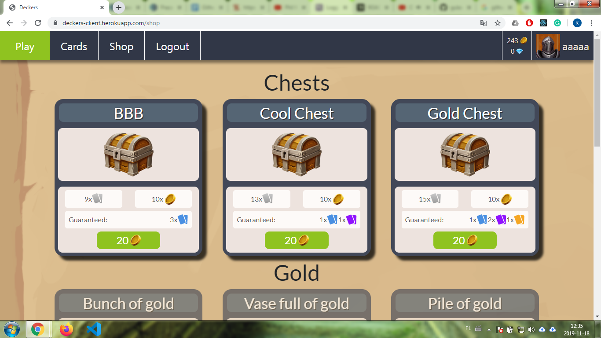
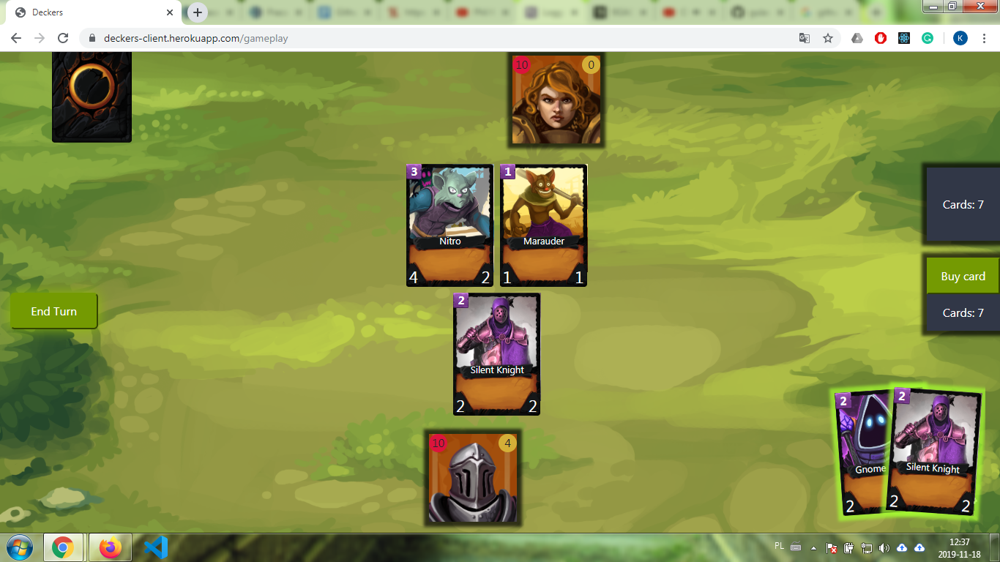

Deckers is an online digital collectible card game offering easy gameplay rules and some new and fresh look on deck building making card composition more important than cards themselves.
Game currently has deck building, unlocking cards in chests, working matchmaking, simple gameplay with some spells and minions with taunt implemented.

In alpha, there is one fully playable race including spells (16 cards), on four planned. On paper Deckers was supposed to support playing on mobile and touch devices along with browser client, currently only browser client is stable and playable with the possibility to add more later.

The project is currently in alpha and I decided that I won't develop it any longer. The main problems occurred because I made fast decisions without enough research and because I lacked experience.
Game has small to none RWD support as I spend most of my time developing new features and fighting with drag and drop library I picked inaccurately. Both of these issues would take me months to resolve that's why I decided it's time to take my share of experiences and move forward.

Technologies used: React 16, Redux, Redux Thunk, Styled Components, Socket.io, NodeJS, Express, MongoDB, Mongoose.

---------------------------------------------------

Screenshots

